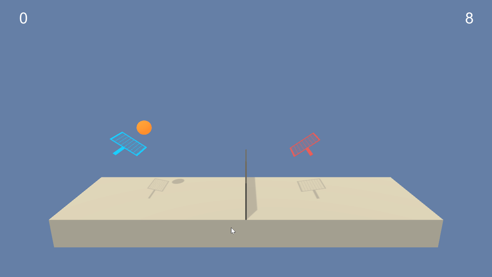
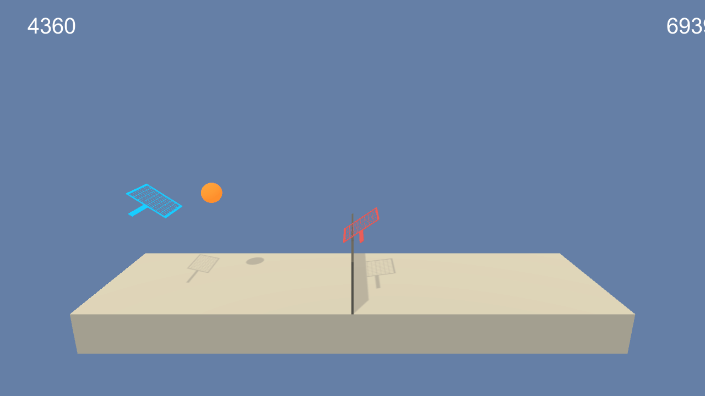

# Project 3: Multi-Agent Tennis Agents - AI DDPG Tennis

### Introduction

For this project, you will work with the [Tennis](https://github.com/Unity-Technologies/ml-agents/blob/master/docs/Learning-Environment-Examples.md#tennis) environment.

An untrained agents behaves like this:

A trained agent looks like this:

Environment and goal information:

- **Environment**: **two agents** control rackets to bounce a ball over a net.
- **Rewards**: +0.1 if an agent hits the ball over the net. -0.01 if the agent misses the ball (ball falls on the ground, or bounces out of bounds).
- **Goal**: Keep the ball in play.
- **Observation Space**: 24 variables corresponding to position, velocity of the ball and the rackets.
- **Action Space**: vector with 2 continuous numbers between [-1,1], corresponding respectively to movement (left/right), and jumping (up/down).

### Instructions for training and testing the tennis agents

Follow the instructions in [`Tennis.ipynb`](./Tennis.ipynb) to get started with training your own version of the tennis agents, or look at the agents in action!

In the repo you'll also find 4 checkpoints, corresponding to the actor-critic weights of 2 agents. To load these pre-trained weights, please check out [the notebook `Tennis.ipynb`](./Tennis.ipynb).

It took a lot of wrestling with hyperparameters and code tuning to make the agents learn correctly from their own taken actions, but we got there after a few days of tweaking:

For a full report on implemention and training details, please see [`./report.md`](./report.md).

Keeping track of experiments is important to gain insight and intuition. Above chart was created by collecting training metadata in an online platform called Weights & Biases. For the full run, progressive hyperparameter tweaks, and model configurations, [check out this project's run here](https://app.wandb.ai/adam_blvck/tennis_ddpg_multi_agent). 

### Solving The Environment

The task is episodic, and in order to solve the environment, the agents had to score an average of +0.5 (over 100 consecutive episodes, after taking the maximum over both agents). Specifically,

- After each episode, we add up the rewards that each agent received (without discounting), to get a score for each agent. This yields 2 (potentially different) scores. We then take the maximum of these 2 scores.
- This yields a single **score** for each episode.

The environment is considered solved, when the average (over 100 episodes) of those **scores** is at least +0.5.

[Check out this project's training runs](https://app.wandb.ai/adam_blvck/tennis_ddpg_multi_agent) over time.

### Getting Started

1. Download the environment from one of the links below.  You need only select the environment that matches your operating system:
    - Linux: [click here](https://s3-us-west-1.amazonaws.com/udacity-drlnd/P3/Tennis/Tennis_Linux.zip)
    - Mac OSX: [click here](https://s3-us-west-1.amazonaws.com/udacity-drlnd/P3/Tennis/Tennis.app.zip)
    - Windows (32-bit): [click here](https://s3-us-west-1.amazonaws.com/udacity-drlnd/P3/Tennis/Tennis_Windows_x86.zip)
    - Windows (64-bit): [click here](https://s3-us-west-1.amazonaws.com/udacity-drlnd/P3/Tennis/Tennis_Windows_x86_64.zip)
    
    (_For Windows users_) Check out [this link](https://support.microsoft.com/en-us/help/827218/how-to-determine-whether-a-computer-is-running-a-32-bit-version-or-64) if you need help with determining if your computer is running a 32-bit version or 64-bit version of the Windows operating system.

    (_For AWS_) If you'd like to train the agent on AWS (and have not [enabled a virtual screen](https://github.com/Unity-Technologies/ml-agents/blob/master/docs/Training-on-Amazon-Web-Service.md)), then please use [this link](https://s3-us-west-1.amazonaws.com/udacity-drlnd/P3/Tennis/Tennis_Linux_NoVis.zip) to obtain the "headless" version of the environment.  You will **not** be able to watch the agent without enabling a virtual screen, but you will be able to train the agent.  (_To watch the agent, you should follow the instructions to [enable a virtual screen](https://github.com/Unity-Technologies/ml-agents/blob/master/docs/Training-on-Amazon-Web-Service.md), and then download the environment for the **Linux** operating system above._)

2. Place the file in the DRLND GitHub repository, in the `p3_collab-compet/` folder, and unzip (or decompress) the file.  

### Repo Structure

- `Tennis.ipynb`: The heart of the code, invoking all required functions to put the agent in an environment and in action.
- `ddpg_tennis.py`: The `Agent` class, implementing an actor-critic-like algorithm called "DDPG", adapted to work with multiple agents.
- `model.py`: The `Model` class, implementing small neural networks for the actor and critic networks.
- `discipline.py`: A file containing the "training regimen" for the agents. Also contains helper functions to save or load the agents.
- `ounoise.py`: OU Noise class, creates noise samples which are random-walk like (based on XYZ).
- `replaybuffer.py`: Simple implementation of a replay buffer, collecting experience as the robot tags along.
- `/media`: contains images used in the repository
- `checkpoint_*.pth`: stored agent weights, allowing us to quickly restore the solved environment state.

### Dependencies

Beneath a list of dependenices required to run and install the agent:

- `python 3.7`
- `unityagents`
- `pytorch`
- `numpy`
- `wandb`
- `jupyter`