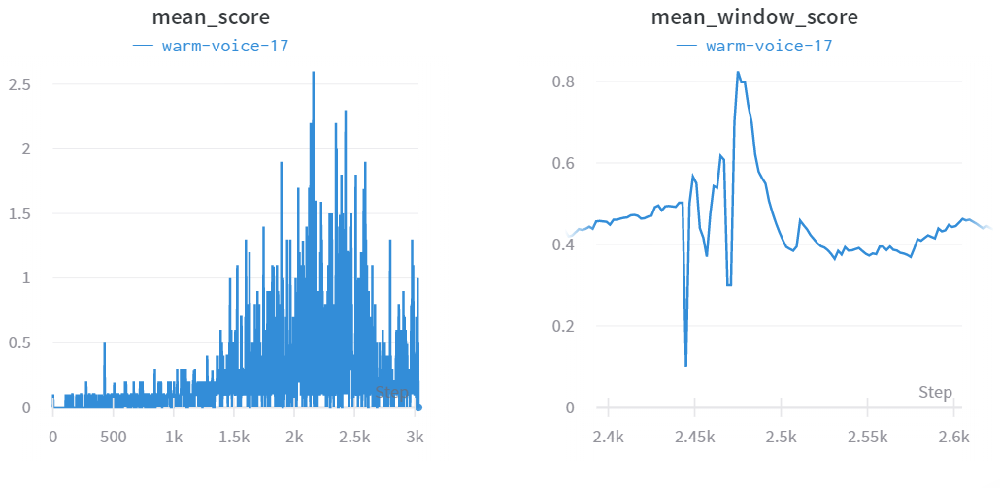

# Report for Project 3 : Tennis

## Problem Description

2 agents, located in the same environment, collaborate with each other to keep the ball "high". How do we accomplish this task?

First, by looking at the state/action space, we see that the problem is a continuous problem: our states and actions are continuous. Looking at previous experience (previous `reacher` project and the `crawler` environment, ...), DDPG does fairly well in such circumstances.

However, we'll need to do some tweaking of the DDPG training code to accomodate two agents whose state/actions influence each other. Let's take a look!

## DDPG Algorithm

### DDPG?

DDPG (Deep Deterministic Policy Gradient) is an algorithm that is said to be actor-critic-**ish**. Why is this? Well, in actor-critic algorithms the critic is used to determine the baseline, to critique the actor neural network. In DDPG, the actor-critic intertwined dance is more akin to DQN, thus the critic is used to approximate the maximizer of the Q-values of the next_state.

In other words, the actor does the predicting of next best action, while the critic tells the actor what the "quality" of this prediction is.

In DDPG, we'll be implementing a local and target network. We do this to decouple received environment experience from immediate 'reaction'  by the agent. Thus, we'll have the following networks, **per agent**.

- A local and target network for the actor.
- A local and target network for the critic.

Every few steps, we'll be blending the local network with the target network.

### Two Agents & Training

Having two interacting agents, we opted to seperate the neural networks of both by created two instances of the `Agent` class, one for each agent.

In every environment step we do the following:

1. The agents are asked to **think** about their favorite action (also called a step). These 2 actions are stacked and passed to the environment.
2. The environment reacts, giving us the next state, rewards for each agent, and an indication of the episode ending.
3. The environment's reaction, together with the chosen parameters of **both agents** are passed to both agent. I call this the **accept** step, or more commonly referenced to as the 'act'.

After having enough experience, the agents start to learn. But since both agents are receiving `SARS'` tuples containing states and actions of both agents, we'll have to take this into account in the **learn step**, when updating the neural networks.

### Updating the neural networks

Just like in DQN, the agents tries random things (more on this later) and saves received experience to a replay buffer. After collecting enough samples, training can begin.

Training involves:

1. Sampling the replay buffer.
2. Updating the critic_local network, based on actor_target predictions
3. Updating the actor_local network, based on critic_local predictions
4. Updating the target networks of both actor and critic. 

Below pseudo-code to explain how training works in DDPG, when multiple agents are present.

First, we sample the replay buffer

~~~python
# sample memory (replay buffer)
experiences = self.memory.sample()
s, a, r, s_, dones = experiences
~~~

Next, we proceed to updating the critic network:

~~~~python
# Get next actions, by ACTOR
a_ = self.actor_target(s_) #a_ = predicted next_actions

# here we'll re-order the action-tuple depending on the perspective of the agent
if agent_id == 0:
    a__ = (a_, a[:, self.action_size:])
elif agent_id == 1:
        a__ = (a[:, :self.action_size], a_)
a_ = torch.cat(a__, dim=1)

# get Q-values for (STATE,ACTION) pair, by CRITIC
Q_targets_next = self.critic_target(s_, a_)

# compute Q targets (discounted)
Q_targets = r + (gamma * Q_targets_next * (1 - dones))

# compute critic loss (how much off is the critic_local compaired to critic_target)
Q_expected = self.critic_local(s, a)
critic_loss = F.mse_loss(Q_expected, Q_targets)

# minimize loss (pytorch style)
self.critic_optimizer.zero_grad()
critic_loss.backward()
torch.nn.utils.clip_grad_norm(self.critic_local.parameters(), 1)
self.critic_optimizer.step()
~~~~

Notice that we performed a "gradient clipping" step just after the `backward()` optimizer step. We do this to make training more stable.

Next, we update the actor based on the critic_local's estimates :

~~~python
# computer actor loss
a_ = self.actor_local(s)

# here too, we'll re-order the predicted action-space based on the perspective of the agent
if agent_id == 0:
    a__ = (a_, a[:, self.action_size:])
elif agent_id == 1:
        a__ = (a[:, :self.action_size], a_)
a_ = torch.cat(a__, dim=1)

actor_loss = -self.critic_local(s, a_).mean()

# minimize loss (pytorch style)
self.actor_optimizer.zero_grad()
actor_loss.backward()
self.actor_optimizer.step()
~~~

Finally, we gradually update the target networks:

~~~python
# slowly update target networks
self.soft_update(self.critic_local, self.critic_target, self.TAU)
self.soft_update(self.actor_local, self.actor_target, self.TAU)
~~~

### Exploration vs Explotation

To learn, we have to try new things and see how well we fair at those.

Same when training robots, we want them to try new things to make them learn.

Since we're working with a continuous space, we can't just epsilon-greedy select actions.

To allow the agent to experience new things, we inject some noise to the returned actions in the **think**-step (step) by the agent.

We do this using the **Ornstein-Uhlenbeck process**. The Ornstein-Uhlenbeck process returns stochastic noise values, which resemble that of a **random walk**, ie: next values are slightly correlated with previous values, but **mean-reverting** in the long term.

Tweaking the parameters of the noise-injecting process is vital for correct agent training.

## Implementation & Training

Training of the algorithm involves tweaking many little things, amongst others:

- Choosing a neural network architecture for the actor and critic.
- Tweaking hyperparameters like learning rate, $\gamma$, $\tau$, Ornstein-Uhlenbeck $\sigma$ and $\theta$, and more.

Over 20 or more runs, I tweaked and modified the neural network architecture and hyperparameters ever so slightly, double checking the backpropagation code to work correctly in a multi-agent setting, and seeking to understand why my agent was *kinda* learning, but not really.

However, after some persistence I stumbled upon a few main issues in my code:

- I was capping the episode length to 1000 timesteps. This meant that even though the agents were playing nicely, I just cut them off abdruptly. By making the episode keep on going till the `done` was reached was vital.

- Decreasing my **BATCH_SIZE** to 128 made the agent train better than with a larger batchsize (>= 512).
- Usually never adjusting the **TAU** factor (gradual mixing of the local network with the target network), I increased it by a magnitude, which to my surprise made the agent train quicker and reach the required `0.5` score. The downside is that shortly after reaching that point, the agents performed worse and didn't seem to recover.
- Judging from previous experience I was trying my agents every few steps a few times. In this experiment, just training the agents once every step did fair better.

[My solving run (mean 0.6+ score, over 100 episodes)](https://app.wandb.ai/adam_blvck/tennis_ddpg_multi_agent/runs/mf2rkms1?workspace=user-adam_blvck), I used the following neural network architectures:

Actor (local & target network):

- Input (Fully Connected): State Size*2 x 256
- Hidden (Fully Connected): 256 x 128
- Output (Fully Connected): 128 x action_size

Critic  (local & target network):

- Input (Fully Connected): State Size*2 x 256
- Hidden (Fully Connected): {256 + (action_size * 2) } x 128
- Output (Fully Connected): 128 x 1

Notice how we're using a **times two**, in the input states. This is because we're feeding both agents both agent's states. The hope would be that taking into account both agent's state would make the individual state better at collaboration. This same dynamic can be seen in the critic network.

The Hyperparameter of the solved environment:

| Hyperparameter | Value    | Usage                                                        |
| -------------- | -------- | ------------------------------------------------------------ |
| BUFFER_SIZE    | int(1e5) | Replay buffer size                                           |
| BATCH_SIZE     | 128      | Mini-Batch size for training                                 |
| GAMMA          | 0.99     | Discount Factor                                              |
| TAU            | 5e-2     | Soft-update factor of target weights                         |
| LR_ACTOR       | 1e-3     | Actor's Learning Rate                                        |
| LR_CRITIC      | 1e-3     | Critic's Learning Rate                                       |
| WEIGHT_DECAY   | 0        | Weight Decay (form of regularization)                        |
| OU_SIGMA       | 0.19     | Ornstein-Uhlenbeck Process - Sigma (volatility)              |
| OU_THETA       | 0.13     | Ornstein-Uhlenbeck Process - Theta (speed of mean-reversion) |
| LEARN_INTERVAL | 1        | Learn every X timesteps                                      |
| LEARN_NUM      | 1        | Learn X times (when learning on interval)                    |

 This is how the training looked like:

There's a little weird peaking going on at around 0.5. This is because the algorithm shut of when the mean window score reached 0.5. I wanted to resume the training, but this has reset the window scores too, giving the weird jiggle:

And this is how all runs look like:

Want to take a look at all runs and their respective hyperparameters?
Check out [my weights and biases report ](https://app.wandb.ai/adam_blvck/tennis_ddpg_multi_agent/reports?view=adam_blvck%2FTennis%20DDPG)!

## Evaluation & Future Work

Training agents certainly requires a lot of patience and delay of gratification. My first many runs didn't fair well because I wasn't correctly attributing actions to the correct agent respectively. In my last run, going for a bigger $\tau$ certainly made the algorithm converge faster, but it made the agent less stable in the long run.

Further experimenting is certainly required. In particular, I would try the following:

- Add an $\epsilon$ hyperparameter which reduces the amount of injected noise in the returned actions by every agent, over time. This way the agent would get more room for experimenting early on, and go towards explotation later on in the training. Not having this implemented might be the reason that the agents spiraled back to a low 0.3 score.
- Add Priority Experience Replay, which would make each agent have a stochastic larger chance of learning from rare or valuable occurances.
- Because the playing field of both agents is mirrored, what if I would train both agents on the same replay buffer and neural network, but somehow mirror the returned actions (or event states, not sure), making the same "neural network" be literally playing against an exact copy of himself?
- What if both agent instances would do a periodic blending of their target networks, or try to communicate the state of their learnings? In this tennis environment this wouldn't improve the run at all, but in a soccer scenario, or perhaps wild-life simulator, it might.

Further along, the current state of AI seems all about getting an intuition for environment setup, agent-learning, hyperparameter tuning, and deep understanding of underlying datastructure manipulations.

I would recommend myself to implement other algorithms and compare results in a similar fashion as captured in this project. In particular, the following algorithms come to mind (and by that I mean, the multi-agent adoption of those):

- [PPO](https://arxiv.org/pdf/1707.06347.pdf)
- [A3C](https://arxiv.org/pdf/1602.01783.pdf)
- [D4PG](https://openreview.net/pdf?id=SyZipzbCb)

Finally, If I would be training AI agents professionally, I'd perform an extensive grid-search across selected hyper-parameters. For this I'd write some code to train 20 different agent instances at the same time, making the grid-search go about faster, albeit at the cost of more infrastructure. I would also love to see an interactive N-Dimensional hyperparameter graph, visually displaying how the score/convergence rates fair against chosen hyperparameters and neural network contents.